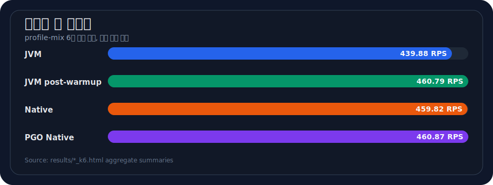
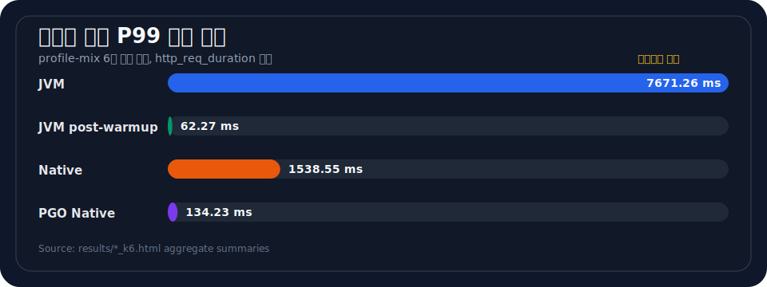

# DevPort k6 부하 테스트

devport API의 읽기 중심 트래픽을 k6로 재현하고, JVM / Native Image / PGO Native Image 빌드의 처리량과 tail latency를 비교하기 위한 벤치마크 리포 입니다. 메인 workload는 `k6/profile-mix.js`이며, 결과 비교는 aggregate summary와 time-series HTML 리포트를 함께 사용합니다.

## 핵심 요약


| 항목           | 내용                                                                                         |
| ---------------- | ---------------------------------------------------------------------------------------------- |
| 목적           | DevPort API의 목록 조회, 카테고리 조회, 트렌딩 티커, 검색 API를 혼합한 읽기 중심 부하 테스트 |
| 메인 스크립트  | `k6/profile-mix.js`                                                                          |
| 기본 부하      | 약`50 RPS`, `6m`                                                                             |
| 비교 부하 예시 | `LIST_MAIN_RPS=325`, `TICKER_RPS=85`, `LIST_CATEGORY_RPS=50`, `SEARCH_RPS=1`로 약 `461 RPS`  |
| 주요 비교 지표 | 총 RPS, 전체 P99 latency, 엔드포인트별 P99 latency, 오류율, status count                     |
| 결과 형식      | `results/*_k6.html` aggregate summary, `results/*_graph.html` time-series chart              |

## 프로젝트 구조


| 경로                                       | 설명                                                                                     |
| -------------------------------------------- | ------------------------------------------------------------------------------------------ |
| `k6/profile-mix.js`                        | 벤치마크와 PGO 학습에 사용하는 메인 혼합 workload                                        |
| `k6/config.js`                             | 기본`BASE_URL`, 검색 키워드, 카테고리, 리스트 페이지 선택 분포                           |
| `k6/summary.js`                            | k6`handleSummary()` 구현, aggregate JSON/HTML 리포트 생성                                |
| `k6/01-baseline-ticker.js`                 | `trending-ticker` 단일 엔드포인트 테스트                                                 |
| `k6/02-articles-list.js`                   | articles main list 단일 엔드포인트 테스트                                                |
| `k6/03-articles-search.js`                 | full-text search 단일 엔드포인트 테스트                                                  |
| `k6/04-articles-list-by-category.js`       | category list 단일 엔드포인트 테스트                                                     |
| `scripts/generate_k6_timeseries_report.py` | raw k6 JSON output 기반 time-series HTML 리포트 생성기                                   |
| `results/*_k6.html`                        | aggregate summary HTML. 모든`*_k6.html` 파일은 같은 레이아웃과 필드 구조                 |
| `results/*_graph.html`                     | RPS/latency 추이 HTML. 모든`*_graph.html` 파일은 같은 레이아웃과 JavaScript payload 구조 |
| `docs/benchmark-workflow.md`               | EC2 실행 절차 기록                                                                       |
| `docs/benchmark-commands.md`               | JVM / Native / PGO 비교 명령 기록                                                        |

## Workload 구성

`k6/profile-mix.js`는 네 개 scenario를 동시에 실행합니다. 모두 `constant-arrival-rate` executor를 사용하며, 각 scenario는 `endpoint` tag를 남겨 summary와 time-series 리포트에서 엔드포인트별 집계가 가능합니다.


| scenario       | 요청                                                          | 기본 RPS | 기본 duration | 역할                         |
| ---------------- | --------------------------------------------------------------- | ---------: | --------------: | ------------------------------ |
| `listMain`     | `GET /api/articles?page={page}&size=9`                        |     `32` |          `6m` | 메인 목록 조회 경로          |
| `ticker`       | `GET /api/articles/trending-ticker?limit=20`                  |      `9` |          `6m` | 가벼운 읽기 API 경로         |
| `listCategory` | `GET /api/articles?category={category}&page={page}&size=9`    |      `5` |          `6m` | 카테고리 필터 목록 조회 경로 |
| `search`       | `GET /api/articles/search/fulltext?q={q}&page={page}&size=20` |      `4` |          `6m` | full-text 검색 경로          |

리스트 계열 요청은 앞쪽 페이지에 가중치를 둡니다.


|         page | 선택 비율 |
| -------------: | ----------: |
|          `0` |     `50%` |
|          `1` |     `25%` |
|          `2` |     `15%` |
| `3` 또는 `4` |     `10%` |

카테고리는 `AI_LLM`, `DEVOPS_SRE`, `BACKEND`, `INFRA_CLOUD`, `OTHER` 중 하나를 무작위로 선택하고. 검색어는 `react`, `python`, `kubernetes`, `llm`, `docker`, `rust`, `typescript`, `postgres`, `ai`, `agent`, `golang`, `vector`, `embedding`, `redis`, `graphql` 중 하나를 사용합니다.

## Thresholds

`profile-mix.js`에 정의된 기준은 다음과 같다.


| 지표              | 조건                        |
| ------------------- | ----------------------------- |
| 전체 실패율       | `http_req_failed rate < 1%` |
| ticker P99        | `< 500 ms`                  |
| main list P99     | `< 1000 ms`                 |
| category list P99 | `< 1000 ms`                 |
| search P99        | `< 2000 ms`                 |

## 환경 변수


| 변수                |              기본값 | 의미                                      |
| --------------------- | --------------------: | ------------------------------------------- |
| `BASE_URL`          | `http://devport.kr` | 테스트 대상 API 서버                      |
| `BUILD_LABEL`       |     `unknown-build` | 결과 파일명과 리포트에 표시되는 빌드 라벨 |
| `RUN_NAME`          |       `profile-mix` | summary 리포트의 실행 이름                |
| `DURATION`          |                `6m` | 각 scenario 실행 시간                     |
| `LIST_MAIN_RPS`     |                `32` | main list arrival rate                    |
| `TICKER_RPS`        |                 `9` | ticker arrival rate                       |
| `LIST_CATEGORY_RPS` |                 `5` | category list arrival rate                |
| `SEARCH_RPS`        |                 `4` | search arrival rate                       |
| `*_PRE_VUS`         |   scenario별 기본값 | 사전 할당 VU 수                           |
| `*_MAX_VUS`         |   scenario별 기본값 | 최대 VU 수                                |

## 결과 파일 형식

이 저장소의 HTML 결과는 두 종류입니다.


| 파일 패턴              | 생성 방식                                  | 포함 데이터                                                   | 해석 단위           |
| ------------------------ | -------------------------------------------- | --------------------------------------------------------------- | --------------------- |
| `results/*_k6.html`    | `k6/summary.js`의 `handleSummary()`        | 총 RPS, 전체 P99, 오류율, status count, 엔드포인트별 RPS/P99  | 실행 전체 aggregate |
| `results/*_graph.html` | `scripts/generate_k6_timeseries_report.py` | Total RPS, endpoint RPS, latency 추이, 요청 수, 평균/최대 RPS | 시간 흐름           |

`*_k6.html` 파일은 크기가 작고 표 중심입니다. `*_graph.html` 파일은 브라우저에서 독립 실행되는 HTML이며, 내부에 긴 JavaScript 배열 payload를 포함합니다. 모든 `*_graph.html` 파일은 같은 구조를 가지며, payload 값만 실행 결과에 따라 달라집니다.

발표용 aggregate 비교와 README preview chart는 tail latency를 P99 기준으로 정리했습니다.

## 현재 포함된 결과

현재 `results/`에 포함된 HTML은 `profile-mix` 6분 실행 결과입니다. `JVM cold`는 JIT warmup 구간을 포함하고, `JVM post-warmup`은 warmup 이후 steady-state 비교를 위한 별도 실행입니다.





### Aggregate 비교


| 빌드             | aggregate                                                    | time-series                                                        |   총 RPS |     전체 P99 |  오류율 |   요청 수 |
| ------------------ | -------------------------------------------------------------- | -------------------------------------------------------------------- | ---------: | -------------: | --------: | ----------: |
| JVM cold         | [`jvm_k6.html`](results/jvm_k6.html)                         | [`jvm_graph.html`](results/jvm_graph.html)                         | `439.88` | `7671.26 ms` | `0.00%` | `158,359` |
| JVM post-warmup  | [`jvm_post_warmup_k6.html`](results/jvm_post_warmup_k6.html) | [`jvm_post_warmup_graph.html`](results/jvm_post_warmup_graph.html) | `460.79` |   `62.27 ms` | `0.00%` | `165,886` |
| Native Image     | [`native_k6.html`](results/native_k6.html)                   | [`native_graph.html`](results/native_graph.html)                   | `459.82` | `1538.55 ms` | `0.00%` | `165,536` |
| PGO Native Image | [`pgo_k6.html`](results/pgo_k6.html)                         | [`pgo_graph.html`](results/pgo_graph.html)                         | `460.87` |  `134.23 ms` | `0.00%` | `165,917` |

### 엔드포인트별 P99


| 엔드포인트             |     JVM cold | JVM post-warmup | Native Image | PGO Native Image |
| ------------------------ | -------------: | ----------------: | -------------: | -----------------: |
| Articles List Main     | `7549.50 ms` |      `41.60 ms` | `1537.48 ms` |      `115.34 ms` |
| Articles List Category | `8239.27 ms` |      `54.52 ms` | `1549.02 ms` |      `120.97 ms` |
| Trending Ticker        | `7714.71 ms` |      `40.61 ms` | `1536.71 ms` |      `109.20 ms` |
| Articles Search        | `8161.04 ms` |     `425.96 ms` |  `992.29 ms` |      `434.22 ms` |

### 결과 해석


| 관찰             | 설명                                                                                               |
| ------------------ | ---------------------------------------------------------------------------------------------------- |
| 처리량           | `JVM post-warmup`, `Native Image`, `PGO Native Image`는 모두 약 `460 RPS` 수준으로 비슷.           |
| JVM cold latency | cold JVM 실행은 초기 JIT warmup 영향으로 P99가 수 초 단위까지 상승.                                |
| JVM steady-state | warmup 이후 JVM은 전체 P99`62.27 ms`로 가장 낮은 tail latency를 보임.                              |
| Native Image     | 현재 샘플에서 Native Image는 처리량은 유지하지만 전체 P99가`1538.55 ms`로 높음.                    |
| PGO Native Image | PGO Native Image는 Native Image 대비 전체 P99가`134.23 ms`로 크게 낮음.                            |
| Search endpoint  | 검색 API는 다른 읽기 API보다 기본 latency가 높고, 빌드별 차이보다 쿼리/DB 경로 영향이 크게 나타남. |

## 재현 명령

비교 결과와 같은 traffic shape를 사용하는 실행 예시다. RPS 합계는 `325 + 85 + 50 + 1 = 461 RPS` 입ㅣ다.

JVM:

```bash
BASE_URL=http://10.0.2.251:18080 BUILD_LABEL=jvm DURATION=6m \
LIST_MAIN_RPS=325 TICKER_RPS=85 LIST_CATEGORY_RPS=50 SEARCH_RPS=1 \
k6 run --out json=results/raw-jvm-461.json k6/profile-mix.js

python3 scripts/generate_k6_timeseries_report.py \
  results/raw-jvm-461.json \
  --output results/jvm_graph.html \
  --build-label jvm \
  --run-name profile-mix
```

Native Image:

```bash
BASE_URL=http://10.0.2.251:18080 BUILD_LABEL=native DURATION=6m \
LIST_MAIN_RPS=325 TICKER_RPS=85 LIST_CATEGORY_RPS=50 SEARCH_RPS=1 \
k6 run --out json=results/raw-native-461.json k6/profile-mix.js

python3 scripts/generate_k6_timeseries_report.py \
  results/raw-native-461.json \
  --output results/native_graph.html \
  --build-label native \
  --run-name profile-mix
```

PGO Native Image:

```bash
BASE_URL=http://10.0.2.251:18080 BUILD_LABEL=pgo DURATION=6m \
LIST_MAIN_RPS=325 TICKER_RPS=85 LIST_CATEGORY_RPS=50 SEARCH_RPS=1 \
k6 run --out json=results/raw-pgo-461.json k6/profile-mix.js

python3 scripts/generate_k6_timeseries_report.py \
  results/raw-pgo-461.json \
  --output results/pgo_graph.html \
  --build-label pgo \
  --run-name profile-mix
```

## PGO와 workload의 관계

`profile-mix.js`는 PGO 학습용 traffic shape로도 사용됩니다. PGO는 학습 시점의 hot path에 최적화되므로, 학습 workload와 실제 비교 workload의 엔드포인트 구성과 RPS 비율이 성능 결과에 직접적인 영향을 주게 됩니다.


| 단계                   | 의미                                                                                        |
| ------------------------ | --------------------------------------------------------------------------------------------- |
| Profiling run          | instrumented 또는 profiling 가능한 빌드에`profile-mix.js` 트래픽을 흘려 profile 생성        |
| Optimized native build | 수집한 profile을 사용해 PGO Native Image 생성                                               |
| Benchmark run          | JVM / Native / PGO Native Image를 같은`profile-mix.js`, 같은 RPS, 같은 데이터 상태에서 비교 |
